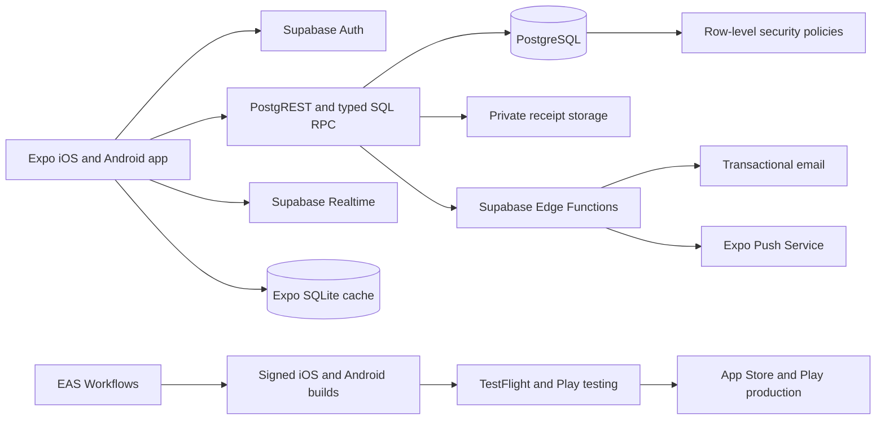
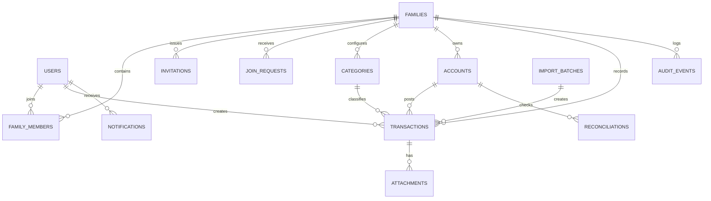

# Family Expense Tracker — Product and System Specification

## 1. Product decision

Build a native iOS and Android application for households rather than a literal spreadsheet clone. Preserve every intended capability of the workbook, but replace spreadsheet limits and fragile formula behavior with database-backed calculations, role-based access, audit history, and collaborative workflows.

The first production release should use:

- Expo, React Native, TypeScript, and Expo Router for one native iOS/Android codebase with platform-native navigation and deep links.
- Expo development builds for day-to-day engineering; EAS Build and EAS Submit for signed store binaries and EAS Update for compatible JavaScript/asset fixes.
- Supabase for managed PostgreSQL, authentication, row-level security, realtime updates, private receipt storage, and backups.
- Native design tokens and accessible React Native primitives; FlashList-style virtualized records for large ledgers.
- A `react-native-svg`-based chart layer with an accessible data view for every visualization.
- Zod for shared validation, Jest/React Native Testing Library for unit/component tests, Maestro for native end-to-end tests, and Supabase database tests for authorization policies.
- Expo SQLite for bounded offline read caches and drafts, Expo SecureStore for session material, and Expo Notifications for mobile push.
- Resend through custom SMTP for production authentication and invitation email delivery.

This is a recommended starting architecture, not a permanent dependency lock. Exact package versions should be selected and locked when implementation begins.

## 2. Source workbook audit

The uploaded workbook contains nine visible sheets, 4,686 formulas, 15 charts, 24 embedded images, two named ranges, date and list validations, conditional formatting, and transaction-entry ranges extending to row 8,000. The workbook has no VBA, pivots, slicers, or external workbook links.

The instruction sheet was treated as product reference material, not as operational instructions. It describes the intended behavior of the template and is useful evidence for the application requirements.

### 2.1 Workbook inventory

| Workbook area | Intended purpose | App equivalent |
|---|---|---|
| Instructions | Onboarding, terminology, usage guidance, FAQs, CSV import guidance | Onboarding checklist, contextual help, help center, import wizard |
| Setup | Currency, reporting start month/year, three-year coverage preview, income categories, expense categories, accounts, notes | Family settings, reporting calendar, category management, account management, household notes |
| Accounts | Current balance, beginning balance, deposits, withdrawals, manual adjustments, last checked date, household total | Accounts dashboard, account ledger, reconciliation status |
| Income | Date, category, amount, account, description, remarks; sorting/filtering | Income transactions and unified transaction list |
| Expenses | Date, category, amount, account, description, remarks; sorting/filtering | Expense transactions and unified transaction list |
| Balance | Date, account, signed adjustment amount, description, remarks | Balance adjustment transaction type |
| Monthly Dashboard | Month/year selector; income, expense, net total, expense-to-income, savings rate, top 20, distributions, full category summaries | Monthly analytics route |
| Annual Dashboard | Fiscal/calendar year selector; monthly totals; income growth; savings trend; combined trend; top 20; cash flow; category totals and averages | Annual analytics route |
| Custom Dashboard | Inclusive start/end date selector; same summary and category analytics as monthly | Custom-range analytics route |

### 2.2 Workbook-derived calculations

The application must reproduce the intended calculations with explicit definitions:

| Metric | Definition |
|---|---|
| Total income | Sum of non-deleted income transactions in the selected family, accounts, members, and inclusive date interval |
| Total expenses | Sum of non-deleted expense transaction amounts in the same filter context |
| Net total / savings | Total income minus total expenses |
| Expense as percentage of income | Total expenses divided by total income; unavailable when income is zero |
| Savings rate | Net total divided by total income; unavailable when income is zero |
| Category total | Sum of transactions matching type and category in the filter context |
| Category percentage | Category total divided by the matching income or expense total; unavailable when denominator is zero |
| Top sources | Categories ordered by total descending, limited to 20; stable tie-break by category name |
| Monthly average by category | Sum across the 12-month reporting period divided by 12, including zero-activity months |
| Account deposits | Income posted to the account |
| Account withdrawals | Expenses posted to the account |
| Account adjustments | Sum of signed balance-adjustment transactions |
| Current account balance | Beginning balance + deposits − withdrawals + adjustments |
| Household balance | Sum of active account current balances |

Money must be stored in integer minor units, such as paise or cents, to avoid floating-point errors. Expense amounts are stored as positive values with transaction type `EXPENSE`; signed values are reserved for balance adjustments. Percentages are calculated from unrounded totals and rounded only for display.

### 2.3 Fidelity corrections required

The application must preserve intent, not workbook defects:

- The Setup sheet supports only 40 income categories, 40 expense categories, and 40 accounts. The app must have no product-level fixed limit; pagination and search handle scale.
- Entry sheets provide rows 7–8,000, but account formulas currently read only transaction rows 7–59. Dashboard formulas read only through row 92 or 172. The app must query all matching records.
- Hidden dashboard helpers contain static category rankings and stale values even though the visible ledgers are empty. The app must compute rankings from current transactions on every relevant query.
- Google Sheets `SPARKLINE` formulas do not render reliably in the imported XLSX and appear as unsupported functions. The app must implement equivalent visual bars/charts natively.
- Workbook zero-denominator formulas often display `0%`. The app should display `—` with an accessible explanation such as “No income in this period,” because a zero percentage is mathematically misleading.
- Account/category blanks are displayed as numeric zero in several cached cells. The app must keep missing labels distinct from zero amounts.
- The workbook currently has no functional sheet protection in the XLSX package. The app must enforce access on the server and in PostgreSQL, not rely on disabled UI controls.

## 3. Product goals and boundaries

### 3.1 Goals

1. Give a household one accurate source of truth for shared income, spending, balances, and trends.
2. Let an owner invite family members by link while retaining approval control.
3. Match every intended workbook entry, setup, account, summary, filter, and chart capability.
4. Make every financial change attributable, recoverable, and visible in an audit trail.
5. Deliver an excellent native phone experience on supported iOS and Android versions, with adaptive tablet layouts where practical.
6. Remove row, category, account, and reporting-year limits.
7. Provide a safe path to import existing spreadsheet or bank CSV data.

### 3.2 Explicit non-goals for the first release

- Bank account aggregation, UPI ingestion, or automatic bank synchronization.
- Double-entry accounting, tax filing, investment portfolio accounting, or business invoicing.
- Debt settlement or Splitwise-style reimbursement calculations between family members.
- AI receipt extraction or automatic categorization.
- Multiple base currencies and exchange-rate conversion inside one family.
- Public financial dashboards or public family discovery.

These can be evaluated after the workbook-parity release is stable.

## 4. Users, tenancy, and roles

The security boundary is a `family`. A user may belong to more than one family and must actively select the current family. Every family-owned row carries `family_id`.

### 4.1 Roles

| Capability | Owner | Admin | Member | Viewer |
|---|---:|---:|---:|---:|
| View shared household data and dashboards | Yes | Yes | Yes | Yes |
| Create income, expense, and adjustment transactions | Yes | Yes | Yes | No |
| Edit/delete own transaction | Yes | Yes | Yes | No |
| Edit/delete another member’s transaction | Yes | Yes | No | No |
| Manage categories and accounts | Yes | Yes | No | No |
| Set beginning balances and reconciliation dates | Yes | Yes | No | No |
| Invite people | Yes | Yes | No | No |
| Approve/reject join requests | Yes | Yes | No | No |
| Change roles | Yes | No | No | No |
| Remove members | Yes | Yes, except owner | No | No |
| Transfer ownership | Yes | No | No | No |
| Delete or export the family | Yes | No | No | No |

The initial onboarding may expose only Owner and Member to keep the UI simple. Admin and Viewer remain supported in the model and can be enabled when needed.

### 4.2 Membership states

`PENDING`, `ACTIVE`, `REJECTED`, `SUSPENDED`, `LEFT`, and `REMOVED`.

Only `ACTIVE` membership grants family access. A valid invitation link may create or associate a `PENDING` join request, but never activates membership automatically.

## 5. Functional requirements

Priority labels: P0 is required for launch, P1 follows immediately after launch, and P2 is an enhancement.

### 5.1 Identity and onboarding

| ID | Pri. | Requirement | Acceptance criteria |
|---|---:|---|---|
| AUTH-01 | P0 | Sign up and sign in with email magic link or OTP | Verified session created; invalid/expired links fail without revealing whether another account exists |
| AUTH-02 | P0 | Google sign-in and Sign in with Apple on iOS | Same email identities resolve to one user according to provider rules; Apple is offered when Google is a primary iOS login option |
| AUTH-03 | P0 | Profile with display name, avatar, locale, and timezone | Profile changes do not alter historical audit actor IDs |
| AUTH-04 | P0 | Sign out current device and all devices | Sessions are revoked appropriately |
| ONB-01 | P0 | First-time choice: create family or accept invite | User cannot enter financial routes without an active family membership |
| ONB-02 | P0 | Create family with name, currency, timezone, start month, and start year | Creator becomes active Owner atomically |
| ONB-03 | P0 | Seed editable default income and expense categories | Defaults can be renamed, reordered, archived, or replaced |
| ONB-04 | P0 | Guided checklist for account, category, and first transaction setup | Completion state persists; all steps remain independently accessible |

### 5.2 Family invitation and approval

| ID | Pri. | Requirement | Acceptance criteria |
|---|---:|---|---|
| FAM-01 | P0 | Owner/Admin creates an invitation link | Server generates at least 128 bits of randomness, stores only a hash, records creator, expiry, maximum uses, and revocation state |
| FAM-02 | P0 | Share/copy link | Link contains no family financial data, role authority, or sequential identifier |
| FAM-03 | P0 | Invite landing page | Shows family name and inviter display name only after token validation; unauthenticated users can authenticate and return to the flow |
| FAM-04 | P0 | Request to join | Valid token produces one idempotent pending request per user and family |
| FAM-05 | P0 | Approval inbox | Owner/Admin sees requester, request date, inviter, and status; approve/reject requires an active privileged membership |
| FAM-06 | P0 | Approval transaction | Approval activates membership and invalidates the request atomically; race conditions cannot create duplicates |
| FAM-07 | P0 | Notifications | Requester receives in-app and email status; owner/admin receives a pending-request notification |
| FAM-08 | P0 | Revoke/expire invitation | Expired, consumed, or revoked token cannot create a request; existing approved membership remains unaffected |
| FAM-09 | P0 | Member lifecycle | Owner/Admin can suspend or remove a member; access stops immediately while audit attribution remains |
| FAM-10 | P0 | Ownership safety | Family always has exactly one owner; owner cannot leave before transferring ownership or deleting the family |
| FAM-11 | P1 | Invite usage policy | Single-use and reusable links supported; default is single-use with seven-day expiry |

### 5.3 Family settings and reporting calendar

| ID | Pri. | Requirement | Acceptance criteria |
|---|---:|---|---|
| SET-01 | P0 | One base currency per family | ISO 4217 currency code drives formatting; a custom symbol may be displayed but does not replace the code |
| SET-02 | P0 | Reporting start month and start year | Start month determines calendar versus fiscal-year boundaries and monthly ordering |
| SET-03 | P0 | Coverage preview | UI shows at least the next three 12-month coverage periods, equivalent to the workbook preview |
| SET-04 | P0 | Family timezone | Date grouping uses the family timezone; stored audit timestamps remain UTC |
| SET-05 | P0 | Household notes | Owner/Admin can edit plain text notes with revision metadata |
| SET-06 | P0 | Settings audit | Changes to currency, calendar, roles, accounts, and categories create audit events |
| SET-07 | P1 | Calendar-change warning | Changing start month previews affected annual reports; historical transactions are not mutated |

Changing base currency after transactions exist requires explicit confirmation. Release one relabels existing amounts and performs no currency conversion.

### 5.4 Category management

| ID | Pri. | Requirement | Acceptance criteria |
|---|---:|---|---|
| CAT-01 | P0 | Separate income and expense categories | Category type cannot be switched after use; archive and replace instead |
| CAT-02 | P0 | Add, rename, reorder, color, and archive | Archived categories remain visible on historical transactions and reports |
| CAT-03 | P0 | Unique active names within type and family | Comparison is trimmed and case-insensitive |
| CAT-04 | P0 | Prevent destructive deletion | Used categories cannot be hard-deleted; unused categories may be deleted by Owner/Admin |
| CAT-05 | P0 | Category filters and search | Available in transaction forms and all relevant reports |
| CAT-06 | P1 | Merge categories | Preview count/value impact; move transactions atomically; preserve an audit record |

### 5.5 Account management and reconciliation

| ID | Pri. | Requirement | Acceptance criteria |
|---|---:|---|---|
| ACC-01 | P0 | Add account with name, type, beginning balance, opening date, optional institution, and display order | Name unique among active family accounts |
| ACC-02 | P0 | Account types | Cash, bank, credit card, e-wallet, investment, loan, and other |
| ACC-03 | P0 | Calculated account dashboard | Shows current balance, beginning balance, deposits, withdrawals, adjustments, and last checked date |
| ACC-04 | P0 | Household current balance | Sum of active account balances; filters can include archived accounts |
| ACC-05 | P0 | Reconciliation | User records actual balance and checked date; app shows expected balance and discrepancy |
| ACC-06 | P0 | Balance adjustment | Signed adjustment uses the workbook Balance semantics and requires account/date; description and remarks optional |
| ACC-07 | P0 | Archive account | Prevent new transactions while retaining history; cannot silently remove balances |
| ACC-08 | P1 | Account detail ledger | Running balance, filters, export, reconciliation history, and linked transactions |
| ACC-09 | P1 | Credit account presentation | Optional account setting can invert display convention without changing stored transaction arithmetic |

### 5.6 Transactions

Use one database table with `type = INCOME | EXPENSE | ADJUSTMENT`. The UI may retain separate quick-add actions and filtered views to match the workbook.

| ID | Pri. | Requirement | Acceptance criteria |
|---|---:|---|---|
| TXN-01 | P0 | Create income | Required date, income category, positive amount, account; optional description and remarks |
| TXN-02 | P0 | Create expense | Required date, expense category, positive amount, account; optional description and remarks |
| TXN-03 | P0 | Create adjustment | Required date, account, non-zero signed amount; optional description and remarks |
| TXN-04 | P0 | Family attribution | Record family, creator, last editor, and `paid_by_user_id`/`received_by_user_id` where relevant |
| TXN-05 | P0 | Edit with optimistic concurrency | Stale editor receives conflict guidance rather than overwriting a newer version |
| TXN-06 | P0 | Soft delete and restore | Deleted rows leave reports immediately; privileged user can restore within retention period |
| TXN-07 | P0 | Sort/filter/search | Date, type, category, account, member, amount range, creator, text, and deleted status |
| TXN-08 | P0 | Pagination/virtualization | Large histories remain responsive; no 8,000-row functional limit |
| TXN-09 | P0 | Validation | Valid family-owned active account/category, valid local date, non-zero rules, minor-unit precision, sane text/file limits |
| TXN-10 | P0 | Audit history | Before/after values, actor, time, action, and request ID retained |
| TXN-11 | P1 | Duplicate transaction | Copies editable fields with a new ID and current audit metadata |
| TXN-12 | P1 | Bulk edit and delete | Preview affected count and require confirmation; operation is authorized per row |
| TXN-13 | P1 | Receipt attachment | Private image/PDF upload, preview, download, replacement, and deletion with family-scoped storage access |
| TXN-14 | P2 | Recurring templates | Generate future drafts/transactions idempotently; separate from actual bank automation |

### 5.7 CSV and workbook migration

| ID | Pri. | Requirement | Acceptance criteria |
|---|---:|---|---|
| IMP-01 | P0 | CSV upload and parse | Support UTF-8, comma/tab/semicolon delimiter detection, quoted fields, and visible parsing errors |
| IMP-02 | P0 | Column mapping | Map date, amount, debit/credit or type, category, account, description, and remarks |
| IMP-03 | P0 | Data preview | User reviews parsed/normalized values before any write |
| IMP-04 | P0 | Validation summary | Valid, warning, and rejected row counts with downloadable error details |
| IMP-05 | P0 | Duplicate detection | Deterministic fingerprint plus user review; importing the same file twice cannot silently duplicate rows |
| IMP-06 | P0 | Atomic batches | Import records carry batch ID; batch can be rolled back by Owner/Admin |
| IMP-07 | P1 | XLSX migration wizard | Read the three ledger sheets, setup categories/accounts, settings, beginning balances, and reconciliation dates from this workbook format |
| IMP-08 | P1 | Import provenance | Preserve original row number/file checksum without storing unnecessary raw bank data indefinitely |
| EXP-01 | P0 | CSV export | Export current filtered transactions with stable headers and ISO dates |
| EXP-02 | P1 | Full family export | Owner receives ZIP containing CSV/JSON data and receipt manifest |

### 5.8 Dashboards and analytics

Every dashboard supports family-wide data by default, with optional member, account, and category filters. Filter state is encoded in the URL where safe so reports can be bookmarked. Private raw details are never placed in URLs.

#### Monthly dashboard (P0)

- Month and year selector, defaulting to the current family-local month.
- Title reflecting the selected month.
- KPI cards: total income, total expenses, net savings, savings rate.
- Income-versus-expense comparison chart.
- Expense-as-percentage-of-income gauge/doughnut with unavailable state.
- Savings-rate card with positive, zero, and negative visual states.
- Income distribution and expense distribution charts.
- Top 20 income categories and top 20 expense categories with amount, rank, and percentage.
- Complete income and expense category summaries with total and percentage, including optionally zero-activity active categories.
- Drill-down from every category/chart segment to the filtered transaction list.

#### Annual dashboard (P0)

- Reporting-year selector and clear `Calendar year` or `Fiscal year` label.
- Exact coverage text, such as `Apr 2026–Mar 2027`.
- KPI cards: annual income, expenses, net savings, and savings rate.
- 12-month overview table ordered from the family start month, with monthly income, expenses, and net.
- Monthly income-versus-expense-plus-net combination chart.
- Income trend and savings trend charts.
- Expense-to-income chart.
- Top 20 income and expense categories with amount and percentage.
- Income and expense distribution charts.
- Cash-flow summary: annual total, monthly average, and each of 12 months for income, expense, net, and savings rate.
- Full income and expense category matrices: annual total, monthly average, and each reporting month.

#### Custom-range dashboard (P0)

- Inclusive start/end dates; same-day range supported; end before start rejected.
- KPI cards and all monthly-style category/top/distribution analytics.
- Optional daily, weekly, monthly, quarterly, or automatic grouping for a trend chart (P1).
- Shareable saved report presets within the family (P1).

#### Dashboard behavior (P0)

- Reports update after committed changes and via scoped realtime invalidation for other open family sessions.
- Empty periods show a deliberate empty state, not stale sample data.
- Loading skeletons reserve final layout space.
- Charts have accessible titles, textual summaries, keyboard focus, tooltips, and underlying data-table access.
- Color never carries meaning alone. Income uses the workbook’s blue family, expense its coral family, and net a neutral/positive/negative semantic color.
- Export current report to CSV at launch and print-friendly PDF in P1.

### 5.9 Notifications and activity

| ID | Pri. | Requirement | Acceptance criteria |
|---|---:|---|---|
| NOT-01 | P0 | In-app notification center | Unread count, mark read, deep link, and family context |
| NOT-02 | P0 | Invitation/join emails | Production SMTP configured; retries do not create duplicate memberships |
| NOT-03 | P0 | Family activity feed | Membership and financial configuration events; transaction details respect current authorization |
| NOT-04 | P1 | Notification preferences | Per-user email/push toggles by event class |
| NOT-05 | P0 | Native push notifications | Approval requests and status updates only after contextual OS permission; taps deep-link to the relevant native screen |

## 6. Information architecture and UI specification

### 6.1 Application navigation

Native bottom-tab navigation:

1. Home
2. Transactions
3. Reports
4. More

`Add transaction` is the prominent contextual action on Home and Transactions. Accounts, Family, Notifications, Import/Export, Settings, Profile, and Help are stack routes reached from the relevant tab or More screen.

The family switcher appears in the native header. It always displays the active family to prevent cross-household entry mistakes.

### 6.2 Core screens

| Screen | Main content | Important states |
|---|---|---|
| Sign in | Email OTP/magic link, Google, and Sign in with Apple on iOS | Sending, sent, provider-cancelled, expired, rate-limited, offline |
| Create family | Name, currency, timezone, reporting calendar | Validation, seed categories, retry-safe creation |
| Invite landing | Family/inviter summary, authenticate, request access | Invalid, expired, revoked, already member, pending, rejected |
| Approval inbox | Pending cards/table, approve/reject | Empty, concurrent decision, insufficient role |
| Home | Current-month KPIs, recent transactions, account balance summary, quick add | New family onboarding, empty month, negative savings |
| Transactions | Unified virtualized list, native filter sheet, add/edit screen | Empty, filtered empty, conflict, soft-deleted |
| Add transaction | Type tabs, fields, optional receipt | Validation, unsaved changes, offline draft |
| Accounts | Household total and account rows | Archived, discrepancy, never reconciled |
| Account detail | Running ledger and reconciliation panel | Actual balance mismatch, adjustment flow |
| Monthly report | Workbook-equivalent monthly dashboard | Zero income, empty data, filtered member |
| Annual report | Workbook-equivalent fiscal/calendar report | 12-month coverage, partial future periods |
| Custom report | Date range and workbook-equivalent analysis | Same date, invalid date order, long range |
| Categories | Income/expense tabs, reorder, archive | Used category, duplicate name, merge preview |
| Family members | Members, roles, pending requests, invitations | Owner safeguards, removed member |
| Import | Upload, mapping, preview, validation, commit | Parser errors, duplicates, rollback |
| Settings | Currency, calendar, timezone, notes, data/export/delete | Historical-data warning, destructive confirmation |

### 6.3 Native mobile behavior

- Design phone-first from 320 logical pixels; primary actions remain reachable with one hand and safe areas are respected.
- Transaction forms are full-screen native routes with platform-appropriate date, file, camera and share controls.
- Ledgers are virtualized stacked records; tablets may use two-pane list/detail layouts without introducing a separate desktop product.
- Charts use horizontal scrolling only when a 12-month categorical axis cannot remain legible.
- Touch targets are approximately 44×44 logical pixels. Forms have persistent labels, not placeholder-only labels.
- Currency values align by magnitude and use locale formatting; exact values remain available to assistive technology.
- Every screen defines loading, empty, error, offline/cache-stale and access-revoked states; VoiceOver and TalkBack reading order is tested.

### 6.4 Visual direction

Carry forward the workbook’s restrained warm-white canvas, muted blue income sections, and muted coral expense sections. Reduce letter spacing, oversized blank areas, and spreadsheet grid visual noise. Use a single sans-serif type family, subtle borders, no gradients or decorative shadows, and semantic red only for errors or negative financial states.

## 7. System architecture

Use direct RLS-protected reads for simple records, typed PostgreSQL RPCs for atomic financial and membership operations, and Edge Functions for privileged side effects such as email, push, file parsing, exports and cleanup. Treat every RPC and Edge Function as a public endpoint: validate input, authenticate, authorize against the active family, apply idempotency where needed, and audit mutations.

### 7.1 Application layers

- `apps/mobile/src/app/`: Expo Router routes, layouts, modal stacks and error states.
- `apps/mobile/src/features/`: family, transactions, accounts, reports, import, notifications and receipts.
- `packages/ui/`: accessible native design-system primitives and tokens.
- `apps/mobile/src/infrastructure/auth`: session persistence, deep links and active-family context.
- `apps/mobile/src/infrastructure/supabase`: typed queries, RPC wrappers and realtime invalidation.
- `packages/contracts`: Zod schemas shared by the app and Edge Functions.
- `packages/domain`: pure money, date-boundary, permission and metric logic.
- `supabase/migrations`: schema, functions, grants, RLS, indexes.
- `supabase/functions`: privileged integrations and asynchronous operations.
- `supabase/tests`: positive and negative authorization tests.
- `apps/mobile/maestro`: native end-to-end suites.

### 7.2 Realtime strategy

Realtime is for scoped invalidation, not the source of truth. Subscribe only to the active family’s relevant changes. After an event, refetch the authoritative aggregate or affected list. Supabase supports Postgres change subscriptions, but aggregate correctness remains in database queries.[^2]

## 8. Data model

### 8.1 Principal tables

| Table | Essential fields and constraints |
|---|---|
| `profiles` | `user_id PK/FK auth.users`, display name, avatar path, locale, timezone, timestamps |
| `families` | UUID, name, currency code, optional symbol override, timezone, fiscal start month 1–12, start year, owner user ID, version, timestamps, deleted_at |
| `family_members` | family/user composite unique key, role, status, approved_by/at, joined_at, removed_at |
| `invitations` | family, token_hash unique, created_by, expires_at, max_uses, use_count, revoked_at |
| `join_requests` | family/user unique active request, invitation, status, decided_by/at, timestamps |
| `categories` | family, type, name, normalized_name, color, sort_order, archived_at; unique active normalized name per type |
| `accounts` | family, name, normalized_name, account_type, opening_date, beginning_balance_minor, sort_order, archived_at, version |
| `transactions` | family, type, local_date, amount_minor, account, nullable category, description, remarks, creator, last editor, relevant family member, import batch, version, timestamps, deleted_at |
| `attachments` | family, transaction, private storage path, MIME type, byte size, SHA-256, creator, timestamps |
| `reconciliations` | family, account, checked_on, expected_balance_minor snapshot, actual_balance_minor, difference_minor, created_by |
| `import_batches` | family, filename, SHA-256, mapping JSON, status, row counts, creator, timestamps, rollback_at |
| `audit_events` | family, actor, action, entity type/ID, before JSON, after JSON, request ID, timestamp; append-only |
| `notifications` | user, family, type, payload, read_at, email status, timestamp |

### 8.2 Database invariants

- UUID primary keys; timestamps use `timestamptz`; transaction business date uses `date`.
- Amounts use `bigint` minor units and pass currency-specific precision validation.
- Income/expense require a matching category type; adjustment requires no category and permits positive or negative amount.
- Income/expense amounts are greater than zero; adjustment is non-zero.
- Referenced account/category must belong to the same family.
- Only active accounts/categories accept new transactions.
- Partial unique indexes prevent duplicate active membership/request records.
- Version columns support optimistic concurrency.
- Financial records are soft-deleted; audit events are append-only and protected from client writes.

### 8.3 Reporting queries

Prefer parameterized SQL functions or views that accept family and period boundaries, then apply RLS and membership checks. Required indexes:

- `transactions (family_id, local_date) WHERE deleted_at IS NULL`
- `transactions (family_id, type, local_date) WHERE deleted_at IS NULL`
- `transactions (family_id, category_id, local_date) WHERE deleted_at IS NULL`
- `transactions (family_id, account_id, local_date) WHERE deleted_at IS NULL`
- trigram or full-text index for description/remarks only after usage justifies it.

For high volume, add monthly aggregate tables refreshed transactionally or asynchronously. Do not add them before query measurements show a need.

## 9. API and server operation contract

Use RLS-protected data reads, PostgreSQL RPCs for first-party atomic mutations/reporting, and Edge Functions for exports, import parsing, email, push callbacks and other privileged integrations. The implementation-ready operation shapes are defined in `API_CONTRACTS.md`.

Representative operations:

- `createFamily`, `updateFamilySettings`, `transferOwnership`, `deleteFamily`
- `createInvitation`, `revokeInvitation`, `requestJoin`, `approveJoinRequest`, `rejectJoinRequest`
- `updateMemberRole`, `suspendMember`, `removeMember`, `leaveFamily`
- `createCategory`, `updateCategory`, `archiveCategory`, `mergeCategories`
- `createAccount`, `updateAccount`, `archiveAccount`, `reconcileAccount`
- `createTransaction`, `updateTransaction`, `deleteTransaction`, `restoreTransaction`, `bulkMutateTransactions`
- `createImportPreview`, `commitImport`, `rollbackImport`
- `getMonthlyReport`, `getAnnualReport`, `getCustomReport`, `exportTransactions`

Mutation response shape: `{ ok, data?, fieldErrors?, formError?, conflict?, requestId }`. Every mutation uses an idempotency key where retries could duplicate financial or membership state.

## 10. Security and privacy requirements

The production security baseline is OWASP MASVS, covering storage, cryptography, authentication, network communication, platform interaction, code quality, resilience and privacy for mobile applications.[^3]

### 10.1 Authorization

- Enable RLS on every exposed family-owned table and combine policies with restrictive PostgreSQL grants. Supabase warns that exposed tables without RLS may be accessible to granted roles and recommends allow/deny policy tests.[^4]
- Default deny. `anon` has no access to financial rows.
- `authenticated` operations require active membership in the row’s family and the necessary role.
- Never trust a client-provided `family_id`, role, amount total, owner ID, or approval state. Derive/check them server-side.
- Keep service-role keys server-only; Supabase service keys bypass RLS.[^5]
- Test every table and operation for: correct member, wrong family, pending member, removed member, viewer write, member editing another member, admin owner mutation, and anonymous access.

### 10.2 Invitations and sessions

- Invitation tokens are random, opaque, hashed at rest, expire, can be revoked, and use constant-time comparison where applicable.
- Rate-limit invitation creation, token validation, login attempts, join requests, and approval mutations.
- Do not log raw tokens, OTPs, cookies, or financial descriptions.
- Validate redirect destinations against a strict allowlist. Supabase email flows support hashed token verification and configured redirect URLs.[^6]
- Require recent reauthentication for ownership transfer, family deletion, full export, and email change.
- Enable security notifications for password/email/identity changes when available.

### 10.3 Data protection

- TLS in transit; managed encrypted storage at rest.
- Private receipt bucket with RLS by active family membership. Storage allows operation-specific policies and denies uploads until policies are created.[^5]
- File allowlist: JPEG, PNG, WebP, PDF; verify MIME signature, maximum 10 MB, randomized storage key, malware scanning before wider rollout.
- Avoid storing bank credentials or full card/account numbers. Optional account institution and last four digits only.
- Redact sensitive values from analytics, traces, and error reports.
- Owner-controlled export and deletion with a documented grace period and backup-retention caveat.

### 10.4 Auditability

- Log all financial creates/updates/deletes/restores, category merges, beginning-balance edits, reconciliation, membership decisions, role changes, exports, and destructive settings changes.
- Audit events contain stable actor/entity IDs and before/after values but never invite tokens or session secrets.
- Ordinary members can view a user-friendly activity feed; sensitive administrative events are Owner/Admin only.

## 11. Non-functional requirements

| Area | Launch target |
|---|---|
| Availability | 99.9% monthly application target, excluding announced maintenance and upstream provider outages |
| Performance | Cold start p75 <3 s on representative supported devices; cached screen transition p75 <300 ms; p95 authenticated read <800 ms; p95 mutation <1.2 s excluding file upload/email |
| Scale | 100 members/family, 100,000 transactions/family, 1,000 categories/accounts combined without correctness limits |
| Accessibility | VoiceOver/TalkBack labels and reading order, dynamic type, contrast, error association, reduced motion, and switch/keyboard access where supported |
| OS/device support | Current and previous two major iOS and Android versions at launch; representative small phone, mainstream phone and tablet smoke tests |
| Localization | Locale-aware dates/numbers; single base currency per family; UI strings prepared for translation |
| Reliability | Idempotent invitation, approval, import, and recurring operations; optimistic concurrency on editable records |
| Recovery | Production daily backups at minimum; quarterly restore rehearsal; RPO/RTO documented before public launch |
| Observability | Structured logs, request IDs, latency/error dashboards, alerting, and audit-log separation |
| Data integrity | No dashboard uses cached client totals as authority; reconciliation tests cover every metric and boundary |

The native app caches bounded read models and form drafts in Expo SQLite and stores only session material in platform-protected SecureStore.[^7] Financial writes remain online-only until a conflict-safe offline outbox is separately designed.

## 12. Testing strategy

### 12.1 Unit tests

- Fiscal-year boundaries for all 12 start months, leap years, month-end, and timezone edges.
- Minor-unit currency parsing and display.
- All metric formulas, zero denominators, negative net savings, category ties.
- CSV parsing, delimiter detection, debit/credit normalization, and fingerprints.
- Permission decision helpers and invitation state machine.

### 12.2 Database and integration tests

- Constraints and triggers for cross-family references and category/type mismatches.
- RLS allow and deny matrix on every CRUD operation.
- Atomic owner creation, join approval, category merge, import commit/rollback, and soft-delete restoration.
- Aggregates independently reconciled to seeded raw transactions.
- Transaction at first/last day of monthly, annual, and custom intervals.
- More than 8,000 transactions and transactions beyond legacy rows 59/92/172.

### 12.3 End-to-end tests

1. Owner creates family, categories, and account.
2. Owner creates invite; new user authenticates and requests access.
3. Pending user cannot read any family data.
4. Owner approves; member sees family and enters income/expense.
5. Two signed-in mobile devices observe refreshed dashboards.
6. Member cannot edit owner’s transaction; admin can.
7. CSV preview catches invalid dates and duplicates; commit and rollback reconcile.
8. Account reconciliation and adjustment produce expected current balance.
9. Monthly, fiscal-year, and custom reports match an independent test oracle.
10. Removed member immediately loses all access.

### 12.4 Security and quality gates

- Typecheck, lint, unit, integration, RLS, accessibility smoke, and Maestro critical-path tests required on release candidates.
- Dependency and secret scanning enabled.
- Migration lint/dry run and production backup check before deployment.
- Manual Android/iOS review on representative phones for dashboards, deep links, push and receipt flow.
- No P0 defect, broken authorization test, data-loss scenario, or unexplained reporting variance at release.

## 13. Product analytics

Collect only operational metadata, never amounts, descriptions, remarks, account names, or receipt contents.

Recommended events:

- onboarding started/completed and step completion
- family created; invitation created/opened; join requested/approved/rejected
- transaction created by type; edit/delete/restore outcome
- import uploaded/previewed/committed/rolled back with row counts
- report opened by monthly/annual/custom type and filter count
- reconciliation completed and discrepancy-present boolean
- error class, latency bucket, and feature route

Success measures after pilot:

- onboarding completion rate
- time to first account and first transaction
- weekly active families and contributing members per family
- invitation-to-approved-member conversion
- percentage of active families with at least two contributors
- report usage and reconciliation completion
- import failure and duplicate-prevention rates
- support incidents involving incorrect totals or unauthorized access (target zero)

## 14. Implementation roadmap

### Phase 0 — Foundation and parity fixtures (1 week)

- Confirm open product decisions.
- Create Expo repository, development builds, environments, native design tokens, schema conventions, CI, and seed data.
- Encode workbook-derived formulas as executable test fixtures before UI work.

### Phase 1 — Identity, family, and authorization (2 weeks)

- Auth, profiles, create/switch family.
- Membership roles, invitation tokens, pending approval flow, email templates.
- Database grants/RLS and negative authorization suite.

### Phase 2 — Setup, accounts, and transactions (2–3 weeks)

- Currency/reporting calendar, categories, accounts, beginning balances.
- Unified transaction CRUD, filters, soft deletion, audit events.
- Account totals and reconciliation.

### Phase 3 — Workbook-parity reports (2–3 weeks)

- Monthly, annual fiscal/calendar, and custom-range calculations.
- All 15 chart purposes represented in responsive components.
- Drill-downs, empty/zero states, accessible data views, performance indexes.

### Phase 4 — Import/export and production hardening (2 weeks)

- CSV mapping/preview/dedup/rollback; filtered exports.
- Universal links/App Links, push credentials, store configuration, and private receipts if included in launch.
- Observability, rate limits, security checks, load tests, backup/restore drill.

### Phase 5 — Pilot and launch (1–2 weeks)

- Seed/migrate the owner’s workbook configuration and test data.
- Pilot with one or two real households.
- Reconcile every report against independently calculated controls.
- Fix usability and data-integrity issues; production release and monitoring.

Estimated elapsed time for one focused full-time developer: 10–13 weeks for P0 plus a limited P1 set. A two-person team can shorten calendar time, but authorization, migration, and reporting tests remain sequential quality gates.

## 15. Deployment and operations plan

### 15.1 Environments

- Local: Supabase CLI/local stack plus Expo development build; synthetic data only.
- Preview: EAS internal-distribution build with a preview bundle/package suffix and non-production backend.
- Staging: dedicated Supabase project, production-like EAS profile, test email domain, TestFlight internal and Play internal tracks.
- Production: separate Supabase and EAS environments, final bundle/package IDs, App Store/Play distribution, restricted administrative access.

Never let preview or staging builds connect to the production database.

### 15.2 CI/CD

1. Pull request runs quality gates and may publish an internal preview build/update.
2. Database migration is reviewed together with RLS/grant tests.
3. Merge to main migrates and validates staging automatically.
4. Smoke and end-to-end tests run against staging.
5. Production release requires an approval, verified backup, store metadata review and phased rollout plan.
6. Run backward-compatible database migration first, deploy app second, remove old schema only in a later release.
7. Roll back compatible JavaScript/assets through EAS Update channels or submit a corrective store binary; roll forward database migrations whenever possible.

EAS Build produces signed iOS/Android binaries, EAS Submit uploads them to store systems, and EAS Workflows automates builds, updates, submissions and native E2E tests.[^8] Supabase provides a full Postgres database, daily backups on paid plans, and optional point-in-time recovery.[^9]

### 15.3 Production checklist

- Final iOS bundle identifier, Android application ID, universal-link/App-Link domain, app icons, splash assets and store listings.
- Exact authentication redirect allowlist.
- Custom SMTP and verified sender domain; disable link rewriting/tracking for auth links where it can break verification.[^10]
- RLS/grants enabled and tested on every exposed table and storage bucket.
- Service keys present only in server environment variables.
- Spend caps/budget alerts, rate limits, log redaction, alert routing.
- Daily backup retention confirmed; manual restore tested before launch.
- Terms, privacy notice, retention/deletion process, and support contact published.
- In-app account deletion, Apple privacy disclosures, Google Data Safety declaration, review/demo account and review notes.
- FCM/APNs push credentials and tested notification tap routing.
- Owner account protected with MFA where available.
- Seed/demo data excluded from production families.

### 15.4 Indicative running cost

Start development on free tiers where practical. Production cost consists of Supabase, Expo/EAS usage above free allowances, transactional email, a small deep-link fallback domain/host if required, and Apple/Google developer memberships. Current official prices and quotas must be rechecked at launch.[^11][^12][^13]

## 16. Risks and mitigations

| Risk | Mitigation |
|---|---|
| Cross-family data leak | RLS plus restrictive grants, server authorization, negative tests, no unscoped admin queries |
| Incorrect fiscal reporting | One canonical period-boundary library, database tests for every start month, independent reconciliation fixtures |
| Duplicate import or approval | Idempotency keys, unique constraints, transaction boundaries, batch fingerprints |
| Spreadsheet migration mismatch | Preview mapping, explicit legacy quirks, control totals, preserve provenance, user sign-off |
| Concurrent edits overwrite data | Version column and conflict UI |
| Stale dashboards | Authoritative refetch after realtime invalidation and mutation; no static hidden helper data |
| Misleading zero percentages | Unavailable state with explanation when denominator is zero |
| Receipt exposure | Private bucket, family RLS, short-lived signed access, file validation |
| Owner lockout | Ownership-transfer safeguards, recovery procedure, no deletion without recent authentication |
| Cost growth | Indexed queries, measured aggregation, quotas/spend alerts, retention policies |

## 17. Product decisions finalized for implementation

1. Use `FamilyLedger` as the working product name and modernize the workbook’s blue/coral identity for native mobile UI. Final trademark, logo and store-name clearance remain a brand-launch task.
2. Every active approved member sees all shared transactions at launch. Private transactions are deferred because they change household totals and trust semantics.
3. A Member may edit/delete only records they created. Admin and Owner roles may correct any household record.
4. Receipt attachments are P1 immediately after the launch-critical flow unless the pilot makes them mandatory earlier.
5. Launch authentication is email OTP/magic link plus Google. Offer Sign in with Apple on iOS when Google is available there.
6. Launch with a clean-start onboarding path and CSV import. Purpose-built import from the original XLSX template is deferred.
7. Seed India-oriented editable defaults: INR, `Asia/Kolkata`, and common household income, expense and account categories.
8. Soft-deleted transactions remain restorable for 30 days. Family deletion uses a 30-day grace period and can be cancelled by the Owner during that window.

## 18. Definition of launch-ready

The application is launch-ready when:

- Every workbook-to-app item in Section 2 has a passing acceptance test or an explicitly approved replacement.
- Invitation links create pending requests and no unapproved user can read family data.
- Monthly, annual, and custom totals reconcile to independent test calculations for boundary and high-volume cases.
- Account balances reconcile as beginning + income − expense + adjustments.
- CSV import preview, duplicate handling, commit, and rollback are tested.
- All P0 functional requirements pass in signed release builds on supported iOS and Android versions.
- RLS/grant tests, end-to-end membership tests, accessibility smoke tests, and security gates pass.
- Production backup and restore, application rollback, alerting, and support procedures have been exercised.
- A real household pilot completes onboarding, invitation/approval, transaction entry, reporting, and reconciliation without data correction outside the app.

## Sources

1. Uploaded workbook, `Expesne Tracker sheet.xlsx`, including formulas, validations, chart bindings, formatting, embedded images, and instruction content; audited 10 September 2026.
2. Expo, Router and native deep-linking documentation, accessed 10 September 2026.[^1]
3. Supabase, “Realtime,” official documentation, accessed 10 September 2026.[^2]
4. OWASP, “Mobile Application Security Verification Standard,” official project page, accessed 10 September 2026.[^3]
5. Supabase, “Row Level Security,” official documentation, accessed 10 September 2026.[^4]
6. Supabase, “Storage Access Control,” official documentation, accessed 10 September 2026.[^5]
7. Supabase, “Email Templates” and “Passwordless Email Logins,” official documentation, accessed 10 September 2026.[^6]
8. Expo, SQLite and SecureStore official documentation, accessed 10 September 2026.[^7]
9. Expo, EAS Build, Submit, Update, and Workflows official documentation, accessed 10 September 2026.[^8]
10. Supabase, “Database,” official documentation, accessed 10 September 2026.[^9]
11. Supabase, “Send emails with custom SMTP,” official documentation, accessed 10 September 2026.[^10]
12. Supabase, Expo, and Resend official pricing pages plus Apple/Google developer program requirements, accessed 10 September 2026.[^11][^12][^13]

[^1]: [Expo Router](https://docs.expo.dev/router/introduction/); [Supabase native mobile deep linking](https://supabase.com/docs/guides/auth/native-mobile-deep-linking)
[^2]: [Supabase: Realtime](https://supabase.com/docs/guides/realtime)
[^3]: [OWASP Mobile Application Security Verification Standard](https://mas.owasp.org/MASVS/)
[^4]: [Supabase: Row Level Security](https://supabase.com/docs/guides/database/postgres/row-level-security)
[^5]: [Supabase: Storage Access Control](https://supabase.com/docs/guides/storage/security/access-control)
[^6]: [Supabase: Email Templates](https://supabase.com/docs/guides/auth/auth-email-templates); [Supabase: Passwordless Email Logins](https://supabase.com/docs/guides/auth/auth-email-passwordless)
[^7]: [Expo SQLite](https://docs.expo.dev/versions/latest/sdk/sqlite/); [Expo SecureStore](https://docs.expo.dev/versions/latest/sdk/securestore/)
[^8]: [EAS Build](https://docs.expo.dev/build/introduction/); [EAS Submit](https://docs.expo.dev/deploy/submit-to-app-stores/); [EAS Update](https://docs.expo.dev/eas-update/introduction/); [EAS Workflows](https://docs.expo.dev/eas/workflows/introduction/)
[^9]: [Supabase: Database](https://supabase.com/docs/guides/database/overview)
[^10]: [Supabase: Custom SMTP](https://supabase.com/docs/guides/auth/auth-smtp)
[^11]: [Supabase Pricing](https://supabase.com/pricing)
[^12]: [Expo pricing](https://expo.dev/pricing)
[^13]: [Resend Pricing](https://resend.com/docs/knowledge-base/what-is-resend-pricing); [Expo store build prerequisites](https://docs.expo.dev/build/setup/); [Apple App Review Guidelines](https://developer.apple.com/app-store/review/guidelines/)
