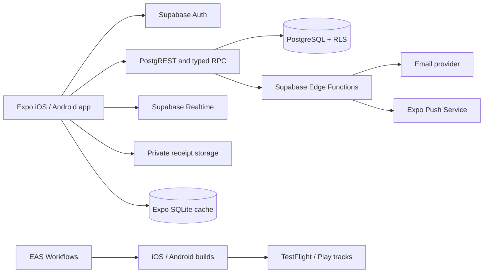

# FamilyLedger Mobile — Implementation Blueprint

Status: implementation-ready planning baseline  
Platforms: native iOS and Android  
Primary client: Expo/React Native with TypeScript  
Backend: Supabase Auth, PostgreSQL, Row Level Security, Realtime, Storage, and Edge Functions

## 1. Architecture decisions

### 1.1 Product shape

FamilyLedger is a native mobile application, not a responsive website or PWA. It is distributed through Apple App Store and Google Play. A very small public HTTPS page may exist only to complete universal-link/app-link handoff when an invitation is opened without the app installed; it is operational infrastructure, not an alternate product UI.

The implementation baseline uses the eight recommended product defaults from the specification until the owner explicitly changes one:

1. Working name `FamilyLedger`; workbook blue/coral palette modernized for native UI.
2. Every active approved family member can see all shared transactions.
3. Members edit their own records; Admins and Owners can correct all records.
4. Receipt attachments are P1, immediately after the launch-critical flow.
5. Email OTP/magic link plus Google; Sign in with Apple is included on iOS when Google is offered.
6. Clean start plus CSV import at launch; purpose-built XLSX import is deferred.
7. India-oriented but editable defaults: INR, Asia/Kolkata, common household categories and account types.
8. Transactions remain restorable for 30 days; family deletion has a 30-day grace period.

### 1.2 Technology stack

| Concern | Selection | Implementation rule |
|---|---|---|
| Mobile runtime | Expo SDK + React Native + TypeScript | Pin the current stable Expo SDK at repository kickoff; use a development build, not Expo Go, for production-grade work |
| Navigation | Expo Router | File-based routes, native stack transitions, bottom tabs, universal links and Android App Links |
| Server state | TanStack Query | Query keys always begin with `familyId`; mutations invalidate the smallest authoritative query set |
| Local UI state | Zustand only where needed | Never mirror authoritative financial records in a global client store |
| Forms and validation | React Hook Form + Zod | Shared schemas live in `packages/contracts`; database constraints remain authoritative |
| Authentication | Supabase Auth | Persist the session with an Expo-compatible secure adapter; refresh tokens on AppState changes |
| Database | Supabase PostgreSQL | All family-owned tables use RLS; money is `bigint` minor units |
| Server operations | SQL RPC for atomic domain operations; Edge Functions for privileged integrations | Direct table access is permitted only for simple RLS-protected reads; no service-role key in the app |
| Realtime | Supabase Realtime | Realtime events invalidate queries; they never replace database totals |
| Offline cache | Expo SQLite | Cache bounded read models and pending drafts; launch financial writes require connectivity |
| Secrets | Expo SecureStore | Store refresh/session material only; never treat it as the source of truth for business data |
| Push | Expo Notifications | Device tokens stored per installation; backend sends approval/invite/security notifications |
| Charts | `react-native-svg`-based chart layer | One accessible data-table fallback for every chart; package choice confirmed in a chart spike |
| Testing | Jest, React Native Testing Library, Supabase database tests, Maestro | Real-device smoke tests are mandatory for deep links, biometrics, camera and push |
| Delivery | EAS Build, EAS Submit, EAS Update, EAS Workflows | Native changes require a store binary; compatible JS/assets fixes may use EAS Update |

Expo recommends Expo Router for new Expo apps and documents native deep-linkable routes. EAS Build creates signed Android/iOS binaries, EAS Submit uploads them to both stores, and EAS Update handles compatible non-native changes between store releases.[^expo-router][^eas-build][^eas-submit][^eas-update]

### 1.3 Runtime boundaries



The app talks to Supabase with a publishable client key. RLS and PostgreSQL grants enforce tenant access. Edge Functions hold privileged credentials and are used for invitation delivery, push delivery, export generation, cleanup jobs and any operation requiring a service-role key.

## 2. Repository structure

Use a pnpm workspace without Turborepo initially. There is one application, so another orchestration layer adds little value.

```text
family-ledger/
├─ apps/
│  └─ mobile/
│     ├─ src/
│     │  ├─ app/
│     │  │  ├─ _layout.tsx
│     │  │  ├─ index.tsx
│     │  │  ├─ (auth)/
│     │  │  │  ├─ _layout.tsx
│     │  │  │  ├─ welcome.tsx
│     │  │  │  ├─ sign-in.tsx
│     │  │  │  ├─ verify-email.tsx
│     │  │  │  └─ auth-callback.tsx
│     │  │  ├─ (onboarding)/
│     │  │  │  ├─ create-family.tsx
│     │  │  │  ├─ accept-invite.tsx
│     │  │  │  └─ pending-approval.tsx
│     │  │  ├─ (tabs)/
│     │  │  │  ├─ _layout.tsx
│     │  │  │  ├─ home.tsx
│     │  │  │  ├─ transactions.tsx
│     │  │  │  ├─ reports.tsx
│     │  │  │  └─ more.tsx
│     │  │  ├─ transaction/
│     │  │  │  ├─ new.tsx
│     │  │  │  └─ [transactionId].tsx
│     │  │  ├─ accounts/
│     │  │  │  ├─ index.tsx
│     │  │  │  ├─ new.tsx
│     │  │  │  └─ [accountId].tsx
│     │  │  ├─ reports/
│     │  │  │  ├─ monthly.tsx
│     │  │  │  ├─ annual.tsx
│     │  │  │  └─ custom.tsx
│     │  │  ├─ family/
│     │  │  │  ├─ switch.tsx
│     │  │  │  ├─ members.tsx
│     │  │  │  ├─ invitations.tsx
│     │  │  │  └─ join-requests.tsx
│     │  │  ├─ settings/
│     │  │  │  ├─ index.tsx
│     │  │  │  ├─ family.tsx
│     │  │  │  ├─ categories.tsx
│     │  │  │  ├─ profile.tsx
│     │  │  │  ├─ notifications.tsx
│     │  │  │  ├─ import.tsx
│     │  │  │  ├─ export.tsx
│     │  │  │  └─ data-privacy.tsx
│     │  │  └─ +not-found.tsx
│     │  ├─ components/        # app-composed components only
│     │  ├─ features/          # vertical feature modules listed below
│     │  ├─ infrastructure/
│     │  │  ├─ supabase/
│     │  │  ├─ cache/
│     │  │  ├─ notifications/
│     │  │  ├─ deep-links/
│     │  │  ├─ analytics/
│     │  │  └─ observability/
│     │  ├─ providers/
│     │  ├─ hooks/
│     │  ├─ theme/
│     │  └─ test/
│     ├─ assets/
│     ├─ app.config.ts
│     ├─ eas.json
│     ├─ metro.config.js
│     ├─ maestro/
│     └─ package.json
├─ packages/
│  ├─ contracts/              # Zod input/output schemas and generated TS types
│  ├─ domain/                 # pure money, period, permission, report logic
│  ├─ ui/                     # native tokens and reusable primitives
│  ├─ eslint-config/
│  └─ tsconfig/
├─ supabase/
│  ├─ config.toml
│  ├─ migrations/
│  ├─ seed.sql
│  ├─ functions/
│  │  ├─ _shared/
│  │  ├─ send-invitation/
│  │  ├─ send-push/
│  │  ├─ request-export/
│  │  └─ cleanup-expired-data/
│  └─ tests/
│     ├─ database/
│     └─ fixtures/
├─ docs/
│  ├─ adr/
│  ├─ api/
│  ├─ runbooks/
│  ├─ threat-model.md
│  └─ store-release-checklist.md
├─ .eas/workflows/
│  ├─ pull-request.yml
│  ├─ preview-build.yml
│  └─ production-release.yml
├─ .github/workflows/
│  ├─ ci.yml
│  └─ database.yml
├─ package.json
├─ pnpm-workspace.yaml
├─ tsconfig.base.json
├─ eslint.config.mjs
├─ .env.example
└─ README.md
```

### 2.1 Feature module contract

Each directory in `apps/mobile/src/features/<feature>` may contain `api`, `components`, `hooks`, `model`, `screens`, and `test`. Feature code cannot import another feature’s internal files; cross-feature behavior moves to `packages/domain` or is coordinated by a route screen.

Feature modules: `auth`, `families`, `memberships`, `invitations`, `transactions`, `accounts`, `categories`, `reports`, `imports`, `exports`, `receipts`, `notifications`, `audit`, and `settings`.

### 2.2 Route guards

The root layout resolves only session state. The authenticated group then resolves the active family. Route guards use these states:

- `SIGNED_OUT`: auth screens only.
- `SIGNED_IN_NO_FAMILY`: create family or accept invite.
- `PENDING`: pending-approval screen; no family data subscription.
- `ACTIVE`: app routes.
- `SUSPENDED_OR_REMOVED`: clear family cache, unsubscribe, show access-revoked state.

The database remains the security boundary; route guards are usability controls.

## 3. Data and synchronization model

### 3.1 Server authority

PostgreSQL is authoritative for memberships, transactions, balances and reports. Mobile cache entries are namespaced by authenticated user and family. On sign-out, family switch, removal or session invalidation, delete that namespace immediately.

### 3.2 Offline behavior for launch

- Previously loaded account, transaction and report summaries may be viewed offline with an “as of” timestamp.
- New or edited transaction forms may be saved as local drafts.
- Financial mutations, approvals, role changes, imports, exports and deletion require connectivity.
- The app does not silently queue launch-version financial writes. This avoids duplicates and cross-device conflict before a durable outbox protocol exists.
- Receipt uploads resume only after the user reopens the draft; partial upload URLs are not persisted.

`expo-sqlite` provides a database that persists across app restarts, while SecureStore uses platform-protected storage for small sensitive values. Neither replaces server truth.[^sqlite][^securestore]

### 3.3 Query keys

```ts
type QueryKey =
  | ['family', familyId]
  | ['members', familyId]
  | ['accounts', familyId, includeArchived]
  | ['categories', familyId, type, includeArchived]
  | ['transactions', familyId, normalizedFilters]
  | ['transaction', familyId, transactionId]
  | ['report', familyId, reportType, normalizedPeriod, normalizedFilters]
  | ['audit', familyId, normalizedFilters];
```

No query can omit `familyId` once the user has selected a family.

## 4. Database implementation

The complete initial DDL is in `DATABASE_SCHEMA.sql`. It defines enums, tables, checks, tenant-safe foreign keys, indexes, update timestamps, membership helper functions and RLS policy skeletons.

### 4.1 Schema rules

- PostgreSQL `uuid` identifiers and `timestamptz` audit timestamps.
- Transaction business date is `date`; reporting boundaries are inclusive start and exclusive end.
- Monetary values are signed `bigint` minor units only for adjustments; income/expense values are strictly positive.
- `family_id` is duplicated into composite foreign keys so a transaction cannot reference another family’s account or category.
- User-visible updates use optimistic concurrency: clients supply `expectedVersion`; mismatch returns `VERSION_CONFLICT`.
- `deleted_at` is used for recoverable deletion. A scheduled cleanup job permanently erases eligible records after the retention window.
- Audit events are append-only and unavailable to direct client mutation.

### 4.2 Reporting contract

Three stable SQL RPCs back all report screens:

- `report_monthly(p_family_id, p_month, p_member_ids?, p_account_ids?)`
- `report_annual(p_family_id, p_year_start, p_member_ids?, p_account_ids?)`
- `report_custom(p_family_id, p_start, p_end_inclusive, p_member_ids?, p_account_ids?)`

Each returns totals, ratios, income/expense category breakdowns, top-20 data and the required time series in one versioned JSON payload. Account balance is calculated from opening balance plus all non-deleted postings through the requested date. The SQL functions check active membership before reading and use the caller’s JWT identity.

## 5. Migration plan

### 5.1 Migration sequence

| Migration | Contents | Rollback/compatibility rule |
|---|---|---|
| `0001_extensions_enums.sql` | `pgcrypto`, enum types | Additive; never renumber enum values |
| `0002_identity_tenancy.sql` | profiles, families, memberships | Auth trigger only creates profile; family creation is an RPC transaction |
| `0003_invites_join_requests.sql` | invitations and approval workflow | Store token hashes only |
| `0004_categories_accounts.sql` | setup entities and defaults | Default seed is RPC-driven, not global rows |
| `0005_transactions.sql` | transactions, soft delete, optimistic version | Establish composite tenant FKs before client access |
| `0006_reconciliation_receipts.sql` | reconciliation, attachment metadata, storage policy | Receipt bucket stays private |
| `0007_imports_audit_notifications.sql` | batch import, audit, in-app notifications, device installations | Audit client grants revoked |
| `0008_reporting_functions.sql` | canonical monthly/annual/custom functions | Version JSON result as `schemaVersion: 1` |
| `0009_domain_rpcs.sql` | atomic family, invite, approval, merge, import and deletion operations | Grant execute only to intended roles |
| `0010_rls_grants.sql` | RLS policies and restrictive grants | Default-deny verification before merge |
| `0011_storage_realtime.sql` | receipt policies and selected realtime publication | No broad publication of audit data |
| `0012_seed_reference.sql` | test/default category/account-type fixtures | Idempotent seed functions |

### 5.2 Change discipline

1. Every schema change is a numbered forward migration; checked-in migrations are immutable after production.
2. A pull request includes the migration, regenerated database types, RLS tests, and application compatibility notes.
3. Use expand/migrate/contract: add nullable/new structures, deploy compatible app, backfill in bounded batches, enforce constraints, then remove old structures in a later release.
4. Production migrations run once from CI with a dedicated deploy identity, never from a mobile client.
5. Destructive migration requires a tested backup, row-count/control-total capture, rehearsal on a production-sized clone, and named approval.
6. Roll forward is preferred. Application rollback is allowed only while the database remains backward compatible.

### 5.3 Spreadsheet and CSV data migration

Launch import supports CSV. The original workbook is treated as a source of configuration and test fixtures, not imported by executing its formulas.

Import phases:

1. Upload file to a short-lived private path and create `import_batch` with SHA-256.
2. Parse into staging rows; keep raw fields plus normalized candidates.
3. User maps date, type/debit-credit, amount, account, category, description and remarks.
4. Validate dates, money precision, type/category compatibility and required references.
5. Show control totals, invalid rows and probable duplicates using deterministic fingerprints.
6. Commit valid selected rows in one database transaction with an idempotency key.
7. Tag created transactions with `import_batch_id` and audit the operation.
8. Allow batch rollback while no created row has been materially edited; otherwise require an explicit conflict resolution.

## 6. API boundary

The full contract is in `API_CONTRACTS.md`. The client uses three operation styles:

1. RLS-protected reads for lists and detail records.
2. PostgreSQL RPC for transactional domain mutations and reporting.
3. Authenticated Edge Functions for side effects requiring private credentials or long-running file generation.

Every mutation accepts `idempotencyKey`; every editable aggregate accepts `expectedVersion`. Dates use `YYYY-MM-DD`, timestamps use UTC RFC 3339, money is integer minor units, and identifiers are UUID strings.

Standard error:

```ts
type ApiError = {
  code:
    | 'AUTH_REQUIRED' | 'MEMBERSHIP_REQUIRED' | 'FORBIDDEN'
    | 'VALIDATION_FAILED' | 'NOT_FOUND' | 'VERSION_CONFLICT'
    | 'IDEMPOTENCY_CONFLICT' | 'RATE_LIMITED' | 'INVITE_EXPIRED'
    | 'INVITE_REVOKED' | 'IMPORT_INVALID' | 'INTERNAL';
  message: string;
  requestId: string;
  fieldErrors?: Record<string, string[]>;
  retryAfterSeconds?: number;
};
```

## 7. Security and privacy

The mobile security baseline is OWASP MASVS, with controls organized around storage, cryptography, authentication, network, platform interaction, code quality, resilience and privacy.[^masvs]

- Store only session material in SecureStore; keep financial cache in an OS-protected app database and exclude it from unintended backups where platform policy permits.
- Do not embed service-role, email-provider, push-service or store credentials in the application binary or EAS Update bundle.
- Redact invite tokens, auth codes, amounts, descriptions, remarks and account names from telemetry.
- Universal links/app links use an opaque single-purpose token; they contain no family or financial details.
- Enforce TLS; do not add custom certificate pinning until a documented threat justifies its operational cost.
- Require recent authentication for ownership transfer, full export, account deletion and family deletion.
- Provide in-app account deletion because Apple requires apps supporting account creation to offer deletion in the app.[^apple-review]
- Provide a review/demo account and keep backend review data available during store review.

## 8. Mobile delivery and environments

### 8.1 Environments

| Environment | App identity | Backend | Distribution |
|---|---|---|---|
| Local | development scheme/bundle ID | Local Supabase | Development build/emulator/device |
| Preview | preview bundle suffix | Shared non-production project with isolated seeded family data | EAS internal distribution |
| Staging | staging bundle suffix | Dedicated staging Supabase project | TestFlight internal + Play internal |
| Production | final bundle/package ID | Dedicated production Supabase project | App Store + Play production |

Preview and staging never connect to production. Deep-link domains and auth redirect allowlists are environment-specific.

### 8.2 CI/CD gates

On pull request:

- install with frozen lockfile;
- lint, typecheck and unit tests;
- database reset, migrations and RLS tests;
- generate types and fail on diff;
- native configuration check;
- Maestro smoke test on a scheduled or release-candidate build.

On merge to `main`:

- deploy backward-compatible staging database migrations;
- publish a staging-compatible update or create a preview binary as appropriate;
- run seeded end-to-end tests.

On release tag:

- verify production backup and migration plan;
- run production migrations;
- build signed iOS and Android binaries with EAS Build;
- submit to TestFlight and Play closed testing first;
- promote only after smoke tests and store metadata/privacy checks;
- release in phases; monitor crashes, auth failures, report discrepancies and push failures.

EAS Workflows can automate builds, submissions, updates and Maestro tests. EAS Submit works from Windows as well as macOS/Linux, though App Store release still passes through App Store Connect review.[^eas-workflows][^eas-submit]

### 8.3 Store prerequisites

- Stable iOS bundle identifier and Android application ID.
- Apple Developer Program and Google Play developer memberships.
- App icon, splash assets, screenshots, description, support URL and privacy-policy URL.
- Apple privacy manifest/questionnaire and Google Data Safety answers aligned with actual SDK behavior.
- Email OTP test account plus reviewer demo family.
- Sign in with Apple when Google is a primary login option on iOS, consistent with Apple guideline 4.8.[^apple-review]
- Account deletion, family deletion grace explanation and support route inside the app.
- FCM credentials for Android push and APNs credentials for iOS push; Expo documents these as platform-specific prerequisites.[^expo-push]

## 9. Observability and operations

- Crash reporting captures stack, app version, runtime version, platform and request ID, not financial content.
- Backend structured logs include actor ID, family ID hash, operation, duration, result code and request ID.
- Alerts: failed migrations, RLS-test regression, auth error spike, report RPC error rate, import commit failure, notification delivery failure and backup failure.
- Every report payload includes `calculatedAt`, `dataVersion` and filter echo for support diagnosis.
- Runbooks cover access incident, incorrect total, stuck import, failed push, store rollback, EAS Update rollback, compromised key and restore rehearsal.

## 10. Definition of implementation-ready

Coding may begin when:

- the eight product defaults are accepted or amended;
- Apple/Google organization accounts and final bundle/package identifiers are available;
- schema and RLS tests can reset successfully from zero;
- API Zod contracts and generated database types compile together;
- workbook parity fixtures have expected totals for monthly, annual, custom and account balances;
- the route map covers every functional requirement;
- the first two sprints have owners and acceptance criteria;
- production data policy, privacy contact and deletion owner are named.

## Sources

[^expo-router]: [Expo Router introduction](https://docs.expo.dev/router/introduction/)
[^eas-build]: [Expo: Create your first EAS Build](https://docs.expo.dev/build/setup/)
[^eas-submit]: [Expo: Submit to app stores](https://docs.expo.dev/deploy/submit-to-app-stores/)
[^eas-update]: [Expo: EAS Update](https://docs.expo.dev/eas-update/introduction/)
[^eas-workflows]: [Expo: EAS Workflows](https://docs.expo.dev/eas/workflows/introduction/)
[^sqlite]: [Expo SQLite](https://docs.expo.dev/versions/latest/sdk/sqlite/)
[^securestore]: [Expo SecureStore](https://docs.expo.dev/versions/latest/sdk/securestore/)
[^expo-push]: [Expo push notification setup](https://docs.expo.dev/push-notifications/push-notifications-setup/)
[^masvs]: [OWASP Mobile Application Security Verification Standard](https://mas.owasp.org/MASVS/)
[^apple-review]: [Apple App Review Guidelines](https://developer.apple.com/app-store/review/guidelines/)
